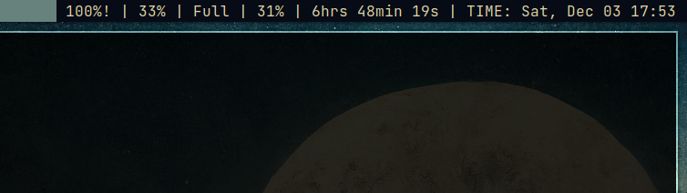

# lstatus

_lstatus_ is (supposed to be) a simple helper to tool to fetch certain trivial info on your Linux* system.

_lstatus_ follows loosely the [Suckless](https://suckless.org) philosophy, ~~trying really hard to be good at one thing: fetching relevant data to be used in any text based status bar~~ being configured by changing the values inside the `config.h` header and recompiling it.

(*) Yes, only Linux is supported so far, mostly due to my familiarity and _lstatus_'s heavy reliance on the system's directory structure.

**Interested? [See the usage section.](#usage)**

## Why?
Why not?

Seriouly though, I had the idea to build this when, while tinkering with `dwmstatus`, I realized how much work goes into solutions like it and thought to myself, _"I can do that!"_.

## Installation

Clone this repo, customize it and install it with `sudo make install`. Future installations should be done with `sudo make clean install`.

## Usage

There are two ways to use _lstatus_, [alongside _dwm_](#using-it-alongside-dwm) and [using its output directly](#using-lstatuss-output-directly)

### Using it alongside _dwm_:

This is the default behavior for _lstatus_, requiring X11 libs to function properly.

When using _lstatus_ alongside _dwm_, its output will be inserted as X's root name, so that _dwm_ bar is able to display it.

If, for some reason, you want see its output for yourself in your shell while using _lstatus_ this way, simply invoke it with `lstatus --output`.


### Using _lstatus_'s output directly

If you don't use _dwm_ or don't want to use _lstatus_ alongside it there is absolutely no reason to allow _lstatus_ to insert its output as X's root name, which means that `use_setxroot` should be set to `false`.

Furthermore, if that is your case, you can go even further an remove **all** X11 related logic from _lstatus_. To do that:
1. Remove the `xsetroot_name` function implementation and calls from the `main.c` file
2. Remove the inclusion of `X11/Xlib` from the `main.c` file
3. In the Makefile, alter CFLAGSX and LDFLAGSX to CFLAGS and LDFLAGS 
    respectvely

#### Example: Using its output

```bash
#!/bin/bash

while [ true ]
do
  status = lstatus

  # do something with the $status here
  sleep 1
done

# If you actually use this, make sure to
# invoke this script with '/path/to/script.sh &'
# to run it as a seperate process

```

Result when executing the script:


